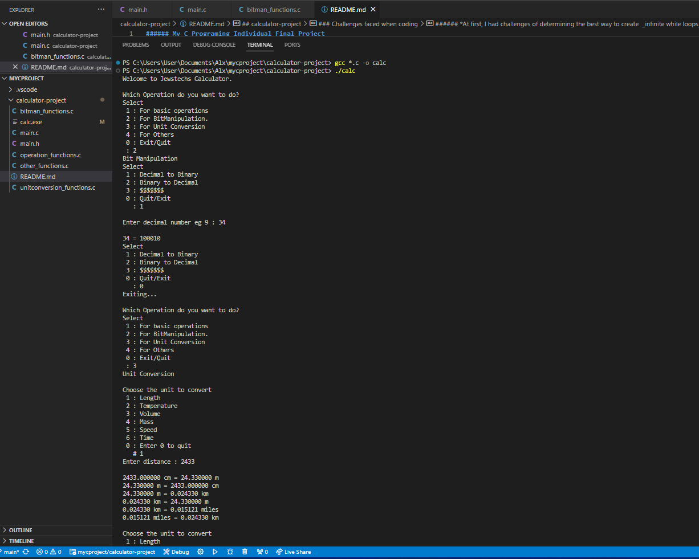

###### My C Programing Individual Final Project
## calculator-project
###### *developer @dev-wambetsa*

### Modules
###### *standard Operations, bit manipulation, unit conversion, others*

### standard operations
###### *division, mltiplication, addition, subtraction, modulus*

### bit manipulation
###### *binary, decimal, hexadecimal, octal, shift - left right, bitwise operation - and or, not, nand, nor, xor*

### units conversion
###### *length - cm, m, km, miles. volume - cm, m. temperature degrees, FH. mass - g, kg. speed - km/hr m/s. time - hrs, min, sec*

### others
###### _cube, square, cuberoot, squareroot, factorial of a number, sum odd nums btn 0 and x, sum even nums btn 0 and x_

### structure of the program
while loop  
&nbsp switch stt  
        case 1:  
            logic  
            break;  
        case 2:  
            while loop  
                if stt  
                else if stt  
                else if stt  
                else  
            break;  
        case 3:  
            while loop  
                if stt  
                else if stt  
                else if stt  
                else if stt  
                else if stt  
                else  
            break;  
        case 4:  
            break;  
                if stt  
                else if stt  
                else if stt  
                else if stt  
                else  
            while loop  
        case 0:  
            logic  
            break;  
        default:  

### Challenges faced when coding
###### *At first, I had challenges of determining the best way to create  _infinite while loops_ and exit the loop*
###### *I also find it hard to understand sequence of processes* eg _converting decimal number to binary_

### How to Run the code
###### - *Clone the repository*
###### - *Ensure gcc is enabled*
###### - *Compile the code using* __gcc *.c -o calc__
###### - *Run the executable file using* __./calc__

### Output of the program

### RECOMMEND ANY CHANGES AND MODIFICATIONS
- __jewstechs\@gmail.com__

### Thank you for your time